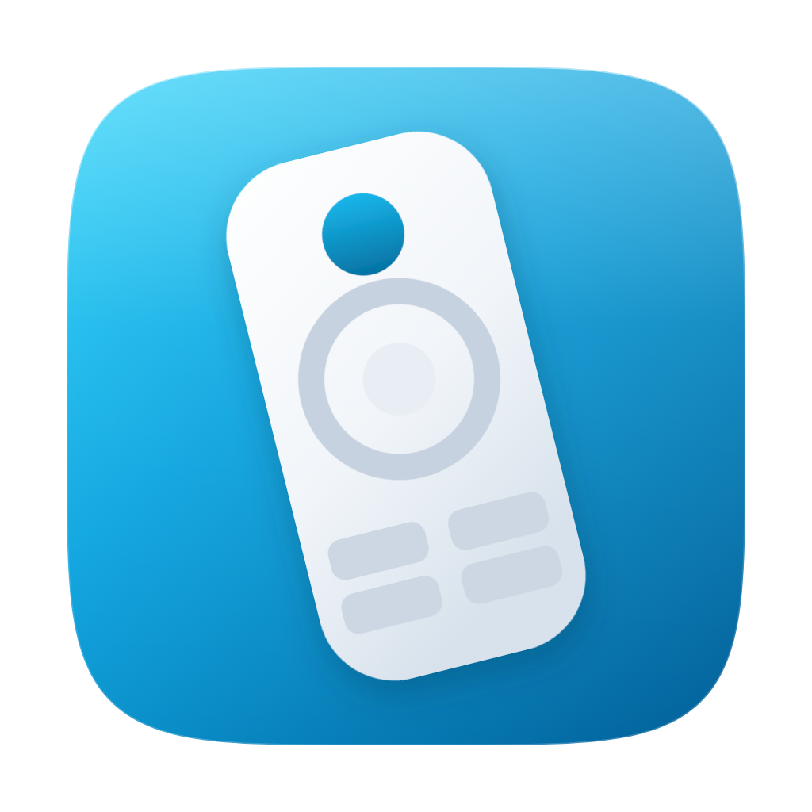
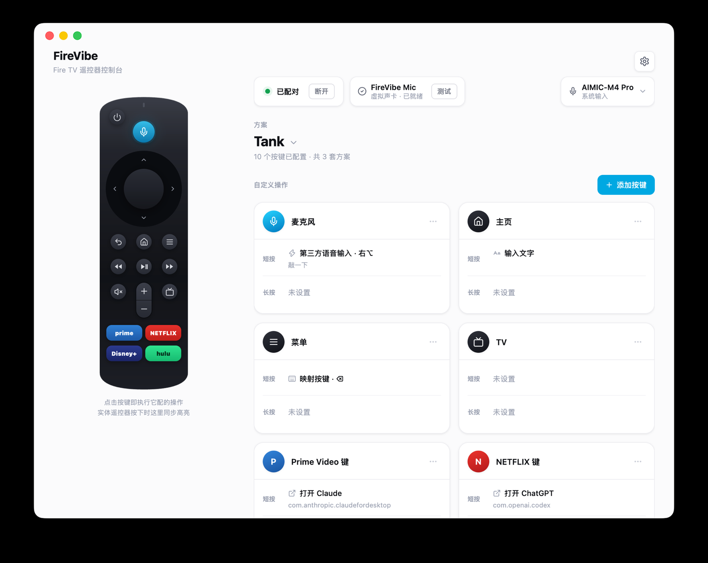
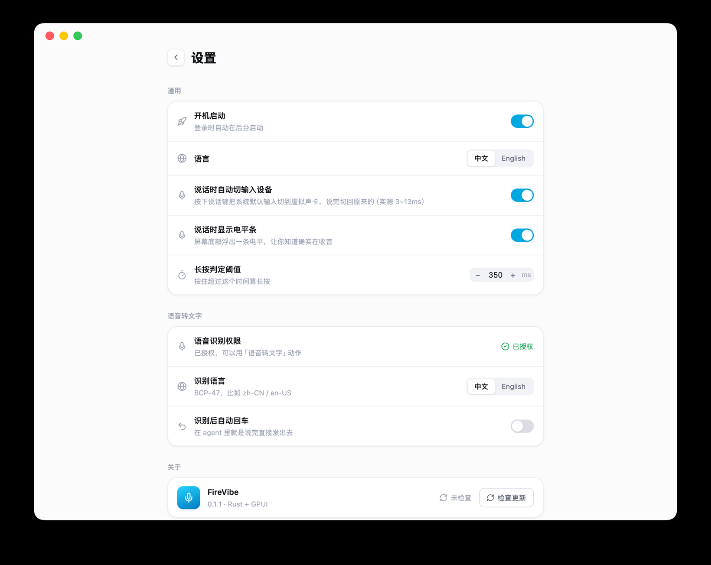

<div align="center">



# FireVibe

**把 Fire TV 遥控器变成 Mac 的遥控器 + 麦克风**

把闲置的 Fire TV 遥控器用起来：切歌、调音量、翻页、一键唤起常用应用，
按住麦克风键说话，文字直接落进输入框。

[下载最新版](https://github.com/tankxu/firevibe/releases/latest)



</div>

## 支持的遥控器

| 型号 | 状态 |
|---|---|
| **Fire TV Alexa Voice Remote（3rd Gen）** — VID `0x0171` / PID `0x0421` | ✅ 已实测，21 个按键全部完成测绘 |
| 其它 Fire TV 遥控器（Lite / Pro / 早期型号） | ⚠️ 未经测试。蓝牙配对后应能读到按键，但键位映射、麦克风和硬件层映射都是按 3rd Gen 的设备 ID 实现的 |

## 能干什么

**21 个键都能改，短按长按各配一个动作**

可以映射成键盘按键、输入一段预设文字、打开指定应用、执行 AppleScript 或 shell 命令，
也可以单独禁用某个键。支持多套方案随时切换 —— 比如写代码一套、看视频一套。

**没配过的键自动直通，装完即可使用**

方向键 / OK / 返回当键盘用；音量 / 静音 / 播放暂停 / 快进快退走系统媒体键，
调音量时有 macOS 原生的音量提示。快进快退映射为「下一曲 / 上一曲」而不是快进几秒 ——
后者在 macOS 上几乎没有应用支持。

**按住麦克风键说话，文字直接落进输入框**

三种方式，可按使用习惯选择：

| 方式 | 由谁识别 | 说明 |
|---|---|---|
| **内置语音转文字** | macOS 系统（离线） | 无需安装任何组件，不联网，支持中文。按住说话，松手出字 |
| **交给第三方语音输入工具** | 第三方工具 | 麦克风键在硬件层直接变成一个修饰键，与真实键盘按键无法区分 |
| **作为一支麦克风使用** | 任意应用 | 遥控器音频送入虚拟声卡，会议、录音、语音输入都能选它 |

**软遥控器同步高亮**

界面左侧的遥控器会实时高亮你在实体遥控器上按下的键，配置时无需猜测按键对应关系。
点击软遥控器上的按键也会直接执行它配好的动作。

<div align="center">

</div>

## 开始使用

### 第一步：把遥控器配对到 Mac

> **先把 Fire TV Stick 断电**。遥控器一次只能配一台设备，Stick 通着电会把它抢回去。
>
> **必须用 1.5V 碱性 AAA 电池。** 1.2V 充电电池撑不住蓝牙射频的峰值电流，
> 表现是时连时断，很容易被误判成软件问题。

1. **先解除它和 Fire TV 的配对**：同时按住 **← 方向左 + ↺ 返回 + ☰ 菜单**，
   保持 **12 秒**

2. **进入配对模式**：按住 **⌂ 主页** 键 **10 秒**。指示灯先慢闪琥珀色，
   准备好接受连接时会变成**快闪**

3. Mac 上打开 **系统设置 › 蓝牙**，在列表里找到遥控器，点「连接」。
   连上后指示灯闪蓝色

此时按键还不会有反应，需要继续下一步。

### 第二步：下载安装 FireVibe

1. 到 [**Releases**](https://github.com/tankxu/firevibe/releases/latest) 下载 `FireVibe-x.y.z-macos-arm64.zip`

2. 解压后把 **FireVibe.app** 拖入「应用程序」

3. ⚠️ **首次打开会被 macOS 拦下来**（安装包未经 Apple 公证）。
   **右键点图标 →「打开」**，在弹出的对话框中再确认一次

   <details>
   <summary>命令行等价写法</summary>

   ```bash
   xattr -dr com.apple.quarantine "/Applications/FireVibe.app"
   ```

   </details>

### 第三步：给权限

打开 **系统设置 › 隐私与安全性**，把 FireVibe 加进这两项：

| 权限 | 用途 |
|---|---|
| **输入监控** | 读取遥控器按键。不授权则完全收不到按键 |
| **辅助功能** | 代为按下键盘按键、输入文字 |

> 勾完「输入监控」要**完全退出 FireVibe 再重开**才生效。
> 界面上读不到遥控器时会直接提示，并给一个跳转按钮。

用内置语音转文字时还会弹一次**语音识别**授权，同意即可。

到这一步，方向键、音量、播放暂停已经可以使用。其余按键可在界面里点「添加按键」逐个配置。

## 语音输入怎么用

### 内置语音转文字（建议先试这个）

无需安装任何组件。给麦克风键配上「语音转文字」，按住说话、松手，识别出的文字直接
输入到当前焦点所在的输入框。识别在本机离线完成，不联网。首次使用会请求一次
「语音识别」授权。

设置里可以选择识别语言，以及「识别后自动回车」—— 在 AI agent 里相当于说完直接发送。
说话期间屏幕下方会浮出一条电平条，用来确认正在收音（可在设置里关闭）。

### 交给第三方语音输入工具

如果你已经有习惯使用的语音输入工具，给麦克风键配「第三方语音输入」，
选一个修饰键（需与该工具里设置的热键一致）。

按下麦克风键时，这个键会在**硬件层**直接变成所选的修饰键，系统收到的事件与按下真实
键盘完全一致。这一点是关键：部分工具只接受来自硬件的按键，软件合成的事件收不到。

> 该映射只作用于**这台遥控器**，不影响你的键盘。应用退出时自动还原。

### 作为一支麦克风使用

在界面上点「安装」装上随应用附带的虚拟声卡 **FireVibe Mic**（需要管理员密码），
之后任意应用都能在麦克风列表里选到它。按下遥控器的麦克风键，声音即送入其中。

<details>
<summary>为什么要自带一块声卡，而不用现成的 BlackHole？</summary>

语音输入工具通常会把传输类型标记为「虚拟」的声卡从麦克风列表里过滤掉，
BlackHole 就是这样被漏掉的 —— 它根本不出现在候选列表里。

`FireVibe Mic` 基于 BlackHole 修改了一处：让它声明自己是 USB 设备，这样就能被识别。
整个改动只有一行，记录在 [`driver/build.sh`](driver/build.sh)。

</details>

## 常见问题

**遥控器时连时断？**
换成 1.5V 碱性电池。1.2V 充电电池无法满足蓝牙射频的峰值电流。

**授权后按键仍然没有反应？**
勾选「输入监控」后需要**完全退出 FireVibe 再重新打开**才会生效。
升级到新版本不需要重新授权，按键配置也不会丢失。

**如何卸载虚拟声卡？**

```bash
sudo rm -rf /Library/Audio/Plug-Ins/HAL/FireVibeMic.driver && sudo killall -9 coreaudiod
```

**硬件层映射残留了怎么清除？**
正常退出会自动清除，仅在进程被强制结束时才可能残留。手动清除：

```bash
hidutil property --matching '{"ProductID":0x0421,"VendorID":0x0171}' --set '{"UserKeyMapping":[]}'
```

重启 Mac 同样会清除。

## 适用范围

- **macOS 12 或更新**（Apple Silicon）
- 安装包未经 Apple 公证，首次打开需右键 →「打开」（见上面第 2 步）

## 想改代码？

**Rust + [GPUI](https://www.gpui.rs)**（Zed 的 GUI 框架），界面和逻辑都是原生的，
没有 Electron / WebView。音频、HID、事件注入直接调 CoreAudio / IOKit / CoreGraphics。

```
core/     协议、配置、动作执行、语音识别
cli/      命令行：按键测绘、原始报文嗅探、各类自检
ui/       桌面界面
driver/   虚拟声卡的构建脚本
```

工程细节、协议逆向记录、构建和签名的注意事项都在
[**开发笔记**](docs/DEVELOPMENT.md) 里。

## 许可证

FireVibe 自身是 [MIT](LICENSE)。

自带的虚拟声卡基于 [BlackHole](https://github.com/ExistentialAudio/BlackHole)（GPL-3.0），
构建时从上游获取，改动只有一处传输类型 —— 详见 [`driver/NOTICE.md`](driver/NOTICE.md)。
